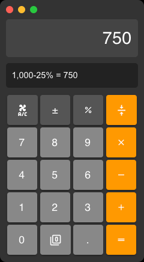
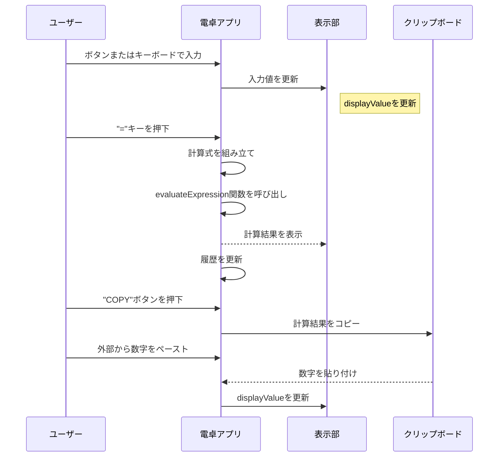

# macos_calc_clone2
- CLINEでAIにお願いして作ったもの
- 今回は独自のワークフローを用いている：未ドキュメント化

<div align="center">



</div>

# 動作デモ
- https://macos-calc-clone2.vercel.app/

# v0の時と同じステップで
- next.jsで電卓を作りたいです。
- 配色は、macosの添付画像の色と、キーボード配列にしてください。ss.png

## 使用フレームワーク
- Next.js（Vercelにデプロイ前提）
- Material-UI (MUI)
- Tailwind CSS
- そのほか必要と思われるライブラリ

# AI操作LOG
- 人間：next.jsで電卓を作りたいです。カレントディレクトリはすでにルートです
- AI：Next.jsプロジェクトの初期化が完了しました。次に、Material-UI (MUI)をインストールし、電卓のUIを作成する準備をします。まず、MUIのインストールを行います。

- 人間：終わったよ
- AI：MUIのインストールが完了しました。これで、src/app/page.tsxのエラーが解消されるはずです。次に、アプリケーションをローカルで実行して、電卓のUIが正しく表示されるか確認します。npm run dev

- 人間：エラーです。※エラーをコピペ
- AI：Next.jsアプリケーションに電卓のUIを追加しました。npm run devが実行中であれば、ブラウザでhttp://localhost:3000にアクセスして、電卓が正しく表示されているか確認してください。電卓のUIは、MUIとTailwind CSSを使用してスタイリングされています。何か問題があればお知らせください。

- 人間：配列とカラーリングは、ss.png　と同じにしてください。また、それ以外の余分は文字などは不要です。画面の中央に寄せてください。
- AI：以下続く・・・

# 電卓アプリ - 仕様書

- この各種仕様書は、ソースコードをもとに生成されたものです。

## 目次

1. [要求仕様書](#要求仕様書)
2. [設計仕様書](#設計仕様書)
3. [詳細設計書](#詳細設計書)
4. [画面UI設計書](#画面ui設計書)
5. [テスト仕様書](#テスト仕様書)
6. [操作説明書](#操作説明書)

---

## 要求仕様書

### 1. 概要

電卓アプリは、シンプルで使いやすい電卓アプリケーションです。ユーザーが基本的な算術計算やパーセント計算を直感的に行えることを目的としています。特に、価格からの割引計算（例：10,000円から25%引き）を正確に行い、履歴に正しい計算式と結果を表示することを重視しています。

### 2. 目的

- 基本的な四則演算（加算、減算、乗算、除算）が可能であること。
- パーセント計算に対応し、割引や税計算が容易に行えること。
- 操作履歴を表示し、過去の計算を確認できること。
- 直感的で使いやすいユーザーインターフェースを提供すること。
- **キーボード操作による入力と計算が可能であること。**
- **外部からの数字のペーストが可能であること。**
- **計算結果をコピーできる機能があること。**

### 3. 対象ユーザー

- 日常的に計算を行う一般ユーザー。
- ショッピング時に割引計算を行いたいユーザー。
- シンプルで見やすい電卓アプリを求めるユーザー。
- **キーボードを使用して効率的に計算を行いたいユーザー。**

### 4. 機能要件

- **数字入力**
  - **ボタン入力**：電卓のボタンを使用して0〜9、および小数点の入力が可能。
  - **キーボード入力**：キーボードから直接数字や小数点を入力可能。
- **演算子**
  - **ボタン入力**：加算（+）、減算（-）、乗算（×）、除算（÷）の利用が可能。
  - **キーボード入力**：キーボードから直接演算子を入力可能。
- **パーセント計算**
  - 数値に対するパーセント計算が可能（例：10,000 - 25% = 7,500）。
- **特殊キー**
  - **AC（オールクリア）**：現在の入力と計算をリセット。
  - **±（符号反転）**：現在の数値の符号を反転。
  - **000キー**：一度に「000」を入力。
- **履歴表示**
  - 過去の計算式と結果を一覧表示。
- **ウィンドウコントロール**
  - アプリケーションの閉じる、再読み込み、フルスクリーン切り替え。
- **クリップボード操作**
  - **コピー機能**：`COPY`ボタンを押すことで、計算結果をクリップボードにコピー可能。
  - **ペースト機能**：外部でコピーした数字を電卓にペースト可能（キーボードの貼り付け操作）。

### 5. 非機能要件

- **ユーザビリティ**
  - 直感的で使いやすい操作性。
  - キーボード操作による効率的な入力が可能。
- **パフォーマンス**
  - 遅延なく即座に計算結果を表示。
- **可読性**
  - 数字の桁区切り（カンマ区切り）で読みやすさを向上。
- **互換性**
  - 主要なウェブブラウザで動作。
  - **クリップボード機能はHTTPS環境またはローカルホストで動作。**

---

## 設計仕様書

### 1. システムアーキテクチャ

- **フロントエンド**
  - React.js（Next.js）を使用したシングルページアプリケーション。
- **スタイリング**
  - Material-UI（@mui）および`@emotion/styled`を使用。
- **言語**
  - TypeScriptを使用して型安全性を確保。

### 2. コンポーネント設計

- **CalculatorContainer**
  - 電卓全体を囲むコンテナ。
- **Calculator**
  - 電卓本体のコンポーネント。
- **Display**
  - 現在の入力や計算結果を表示。
  - **ペースト操作をサポート。**
- **History**
  - 過去の計算履歴を表示。
- **ButtonStyled**
  - 電卓の各種ボタン。
- **WindowControls**
  - ウィンドウの閉じる、再読み込み、フルスクリーンボタン。
- **CopyButton**
  - 計算結果をコピーするためのボタン。

### 3. 状態管理

- **displayValue（string）**
  - 現在の入力または結果を保持。
- **currentExpression（string）**
  - 現在の計算式を保持。
- **history（string[]）**
  - 過去の計算履歴を配列で保持。
- **justEvaluated（boolean）**
  - 直前に計算が実行されたかを示すフラグ。
- **lastOperator（string）**
  - 最後に使用された演算子を保持。
- **copyEffect（boolean）**
  - コピー操作時のエフェクト制御。

### 4. 主要な関数

- **handleButtonClick(label: string)**
  - ボタンがクリックされたときの処理を管理。
- **evaluateExpression(expr: string): number**
  - 計算式を評価して結果を返す。
- **formatNumber(num: string): string**
  - 数字をカンマ区切りでフォーマット。
- **handleKeyDown(event: KeyboardEvent)**
  - キーボード入力を処理。
- **handlePaste(event: ClipboardEvent | React.ClipboardEvent<HTMLSpanElement>)**
  - ペースト操作を処理。
- **copyToClipboard()**
  - 計算結果をクリップボードにコピー。

### 5. パーセント計算のロジック

- 演算子に応じたパーセント計算を実行。
  - **加算・減算の場合**
    - `num1 + num2%` は `num1 + (num1 × num2 / 100)` に変換。
  - **乗算・除算の場合**
    - `num1 × num2%` は `num1 × (num2 / 100)` に変換。
- 単独のパーセント（例：`50%`）は `0.5` に変換。

---

## 詳細設計書

### 1. フロントエンド

#### 1.1 ページ構成

- **page.tsx**
  - アプリケーションのメインページ。
- **layout.tsx**
  - フォントや全体のレイアウトを定義。

#### 1.2 スタイリング

- **Material-UI**
  - ボタンやグリッドレイアウトに使用。
- **@emotion/styled**
  - カスタムスタイルを適用。

#### 1.3 コンポーネント詳細

- **CalculatorContainer**
  - 背景色：黒（#000）
  - 配置：中央揃え（Flexbox）
- **Calculator**
  - 背景色：ダークグレー（#333）
  - サイズ：幅240px
  - 角丸：10px
- **Display**
  - 背景色：やや明るいグレー（#444）
  - フォントサイズ：1.8rem
  - テキスト配置：右揃え
  - **ペースト操作に対応し、テキストの選択・コピーが可能。**
- **CopyButton**
  - 位置：`Display` の右上に配置
  - 機能：`displayValue` をクリップボードにコピー
- **History**
  - 背景色：さらに暗いグレー（#222）
  - フォントサイズ：0.9rem
  - スクロール可能（最大高さ150px）

#### 1.4 関数詳細

- **formatNumber**
  - 入力：数値の文字列。
  - 処理：整数部をカンマ区切りにする。小数点以下はそのまま。
  - 出力：フォーマット済みの文字列。

- **evaluateExpression**
  - 入力：計算式の文字列。
  - 処理：
    - カンマを除去。
    - `×`、`÷`を `*`、`/` に置換。
    - パーセント計算を適用。
    - `eval` 関数で計算式を評価。
  - 出力：計算結果の数値。

- **handleButtonClick**
  - 入力：ボタンのラベル（文字列）。
  - 処理：ラベルに応じて状態を更新。
  - 特殊処理：
    - `AC`：全てリセット。
    - `±`：符号を反転。
    - `%`：パーセント記号を追加し、パーセント計算を可能に。
    - `=`：計算式を評価し、結果を表示および履歴に追加。

- **handleKeyDown**
  - 入力：キーボードイベント。
  - 処理：押下されたキーに応じて `handleButtonClick` を呼び出す。
  - 対応キー：
    - 数字キー（`0`〜`9`）
    - 演算子キー（`+`, `-`, `*`, `/`）
    - 特殊キー（`Enter`, `Backspace`, `Escape` など）

- **handlePaste**
  - 入力：ペーストイベント。
  - 処理：ペーストされたテキストから数字のみを抽出し、`displayValue` に設定。

- **copyToClipboard**
  - 処理：`displayValue` をクリップボードにコピー。
  - エフェクト：コピー成功時に `Display` の背景色を一時的に変更。

### 2. ロジックフロー

1. **数字キー入力時（ボタンまたはキーボード）**
   - `displayValue` に数字を追加。
   - `displayValue` が `'0'` の場合は入力値に置き換え。

2. **演算子キー入力時（ボタンまたはキーボード）**
   - `currentExpression` に `displayValue` と演算子を追加。
   - `displayValue` をリセットしない（表示を維持）。

3. **`%` キー入力時**
   - `displayValue` に `%` を追加。
   - パーセント計算が必要な場合に備える。

4. **`=` キー入力時**
   - `currentExpression` に `displayValue` を追加。
   - `evaluateExpression` 関数で計算式を評価。
   - 結果を `displayValue` に表示し、`history` に追加。
   - `currentExpression` をリセット。

5. **コピー操作**
   - `COPY` ボタンをクリックするか、`Ctrl+C`（または `Command+C`）を押下。
   - `displayValue` をクリップボードにコピー。

6. **ペースト操作**
   - `Ctrl+V`（または `Command+V`）で外部の数字をペースト。
   - ペーストされた数字が `displayValue` に表示される。

---

## 画面UI設計書

### 1. 全体レイアウト

- **画面サイズ**
  - 縦長（モバイルデバイスを想定）、レスポンシブデザイン。
- **電卓位置**
  - 画面中央に配置。

### 2. コンポーネント配置

1. **ウィンドウコントロールとコピー機能**（上部）
   - 左から順に：
     - **閉じるボタン**（赤）
     - **再読み込みボタン**（黄）
     - **フルスクリーンボタン**（緑）
   - 右上に：
     - **`COPY` ボタン**：計算結果をコピー。

2. **表示部**
   - **Display**：現在の入力や結果を表示。
     - テキスト選択とペーストが可能。
     - コピー操作時に背景色が変化するエフェクト。

   - **History**：過去の計算履歴を表示。

3. **ボタン配置**（下部）
   - **上段**：`AC`、`±`、`%`、`÷`
   - **中段1**：`7`、`8`、`9`、`×`
   - **中段2**：`4`、`5`、`6`、`-`
   - **中段3**：`1`、`2`、`3`、`+`
   - **下段**：`0`（幅2倍）、`000`、`.`、`=`

### 3. デザイン要素

- **色合い**
  - **背景**：黒（#000）
  - **電卓本体**：ダークグレー（#333）
  - **ボタン**
    - **数字ボタン**：ライトグレー（#888）
    - **演算子ボタン**：オレンジ（#f90）
    - **特殊ボタン（AC、±、%）**：ダークグレー（#555）
  - **COPYボタン**：背景色はホバー時に変更。

- **フォント**
  - **表示部フォントサイズ**：1.8rem（大きく見やすい）
  - **ボタンフォントサイズ**：1.1rem

- **エフェクト**
  - コピー操作時に `Display` の背景色が一時的に変化。

---

## テスト仕様書

### 1. テスト環境

- **ブラウザ**
  - 最新のChrome、Firefox、Safari、Edge
- **OS**
  - Windows、macOS、Linux

### 2. テスト項目

#### 2.1 基本動作テスト

1. **数字入力テスト**
   - ボタンおよびキーボードから各数字を入力し、`displayValue` に正しく表示されるか確認。

2. **演算子入力テスト**
   - ボタンおよびキーボードから `+`, `-`, `×`, `÷` を入力し、`currentExpression` が正しく更新されるか確認。

3. **計算テスト**
   - 例：`5` `+` `3` `=` → 結果が `8`、履歴に `5+3 = 8` が表示されるか確認。

4. **小数点入力テスト**
   - 小数点を含む数値の計算が正しく行われるか確認。

#### 2.2 パーセント計算テスト

1. **減算でのパーセント計算**
   - 例：`10,000` `-` `25` `%` `=` → 結果が `7,500`、履歴に `10,000-25% = 7,500` が表示されるか確認。

2. **加算でのパーセント計算**
   - 例：`8,000` `+` `10` `%` `=` → 結果が `8,800`、履歴に `8,000+10% = 8,800` が表示されるか確認。

3. **乗算・除算でのパーセント計算**
   - 例：`200` `×` `50` `%` `=` → 結果が `100`、履歴に `200×50% = 100` が表示されるか確認。

#### 2.3 特殊キー動作テスト

1. **ACキー**
   - 途中で `AC` を押下し、`displayValue` と `currentExpression` がリセットされるか確認。

2. **±キー**
   - 現在の数値の符号が反転するか確認。

3. **000キー**
   - 一度に `000` が入力されるか確認。

#### 2.4 クリップボード操作テスト

1. **コピー機能**
   - `COPY` ボタンをクリックし、計算結果がクリップボードにコピーされるか確認。
   - キーボードで `Ctrl+C`（または `Command+C`）を押下し、計算結果がコピーされるか確認。

2. **ペースト機能**
   - 外部で数字をコピーし、電卓上で `Ctrl+V`（または `Command+V`）を押下してペーストできるか確認。
   - ペーストされた数字が `displayValue` に反映されるか確認。

#### 2.5 エラーハンドリングテスト

1. **ゼロ除算**
   - 例：`5` `÷` `0` `=` → エラーが表示されるか確認。

2. **不正な入力**
   - 不正な計算式を入力した場合にエラーが表示されるか確認。

#### 2.6 キーボード操作テスト

1. **数字キー入力**
   - キーボードの数字キーで正しく入力できるか確認。

2. **演算子キー入力**
   - `+`, `-`, `*`, `/` キーで演算子が正しく入力されるか確認。

3. **特殊キー**
   - `Enter` キーで計算が実行されるか確認。
   - `Backspace` キーで数字が削除されるか確認。
   - `Escape` キーで `AC` 操作が行われるか確認。

### 3. テスト結果

- 各テスト項目ごとに、期待される結果と実際の結果を記録し、不具合があれば修正。

---

## 操作説明書

### 1. アプリの起動

- ウェブブラウザでアプリケーションを開きます。

### 2. 基本的な使い方

#### 2.1 数字の入力

- **ボタン操作**
  - 電卓の数字ボタン（`0`〜`9`、`000`）をクリックして数値を入力します。

- **キーボード操作**
  - キーボードの数字キーを押下して数値を入力します。

#### 2.2 演算の実行

- **ボタンまたはキーボードで演算子を入力し、計算を行います。**

1. **加算（+）**
   - 数字を入力 → `+` を入力（ボタンまたはキーボード） → 次の数字を入力 → `=` を入力または `Enter` キーを押下。

2. **減算（-）**
   - 同上。

3. **乗算（×）**
   - 数字を入力 → `×` ボタンをクリックまたは `*` キーを押下 → 次の数字を入力 → `=` を入力。

4. **除算（÷）**
   - 数字を入力 → `÷` ボタンをクリックまたは `/` キーを押下 → 次の数字を入力 → `=` を入力。

#### 2.3 パーセント計算

- 数字を入力 → 演算子を入力 → 次の数字を入力 → `%` ボタンをクリックまたは `%` キーを押下 → `=` を入力。

- 例：`10,000` `-` `25` `%` `=` → 結果は `7,500`。

#### 2.4 特殊キーの使い方

- **AC（オールクリア）**
  - 計算を初期化します（`AC` ボタンをクリックまたは `Escape` キーを押下）。

- **±（符号反転）**
  - 現在入力中の数値の符号を反転します。

- **000キー**
  - 一度に `000` を入力できます。

#### 2.5 履歴の確認

- 計算結果は履歴に表示されます。過去の計算を確認できます。

### 3. クリップボード操作

#### 3.1 コピー機能

- **ボタン操作**
  - `COPY` ボタンをクリックすると、現在の計算結果がクリップボードにコピーされます。

- **キーボード操作**
  - `Ctrl+C`（Windows）または `Command+C`（macOS）を押下してコピーします。

#### 3.2 ペースト機能

- 外部でコピーした数字を電卓上で `Ctrl+V`（Windows）または `Command+V`（macOS）を押下してペーストします。

- ペーストされた数字が `displayValue` に反映されます。

### 4. ウィンドウコントロール

- **閉じるボタン（赤）**
  - アプリケーションを閉じます。

- **再読み込みボタン（黄）**
  - アプリケーションを再読み込みします。

- **フルスクリーンボタン（緑）**
  - アプリケーションをフルスクリーン表示に切り替えます。

### 5. 注意事項

- **ゼロ除算**
  - ゼロでの除算はエラーとなります。

- **演算順序**
  - 本アプリでは入力順に計算が行われます。複雑な数式や括弧を用いた計算には対応していません。

- **セキュリティ**
  - 計算式の評価には `eval` 関数を使用しています。安全な入力を心がけてください。

- **クリップボード機能の制限**
  - クリップボードへのアクセスはブラウザのセキュリティ制限により、HTTPS環境またはローカルホスト（`http://localhost`）でのみ動作します。

---

以上が電卓アプリの仕様書となります。この仕様書に基づいて、同様の電卓アプリケーションを構築することが可能です。追加の要件がある場合は、適宜仕様書を更新してください。

## シーケンス図



## ロジックフローチャート

```mermaid
flowchart TD
    Start[開始] --> Input[ボタンまたはキー入力]
    Input -->|数字| UpdateDisplay[displayValueに数字を追加]
    Input -->|演算子（+,-,×,÷）| OperatorCheck{lastOperatorが存在するか？}
    OperatorCheck -->|はい| ReplaceOperator[演算子を置き換える]
    ReplaceOperator --> Proceed[処理続行]
    OperatorCheck -->|いいえ| AppendExpression[currentExpressionにdisplayValueと演算子を追加]
    AppendExpression --> Proceed
    Proceed --> SetLastOperator[lastOperatorを更新]
    SetLastOperator --> Continue[処理続行]
    Input -->|"="| EvaluateExpression[計算式を評価]
    EvaluateExpression -->|成功| UpdateDisplayResult[結果をdisplayValueに表示]
    UpdateDisplayResult --> UpdateHistory[履歴を更新]
    UpdateHistory --> Continue
    EvaluateExpression -->|失敗| ShowError[displayValueに"Error"を表示]
    ShowError --> Continue
    Input -->|"AC"| ResetAll[displayValueとcurrentExpressionをリセット]
    ResetAll --> Continue
    Input -->|"±"| ToggleSign[displayValueの符号を反転]
    ToggleSign --> Continue
    Input -->|"%"| AddPercent[displayValueに"%"を追加]
    AddPercent --> Continue
    Input -->|"COPY"| CopyToClipboard[displayValueをクリップボードにコピー]
    CopyToClipboard --> Continue
    Input -->|その他| End[終了]
    Continue --> End
```